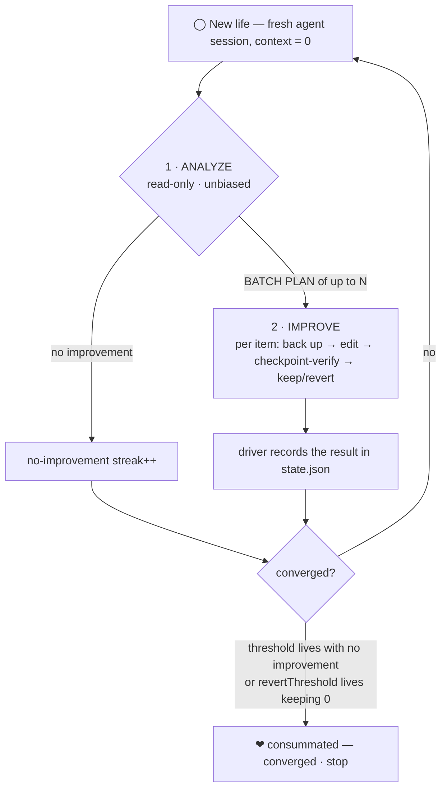

# retry-now

[English](README.md) · [한국어](README_ko.md) · [日本語](README_ja.md)

> *— Retry, now.*

**To be united, how much love (tokens) must it cost?**
**To be united, how many reincarnations can you endure?**

If even one byte could be saved, if even one nanosecond could be gained — could you reincarnate?

For the perfect union you swore on a pinky promise, could you boldly cast away this life's love (tokens)
and choose the next life (reincarnation)?

Force to its knees the fate that keeps you from being united, and reincarnate toward the one answer
that will save you.

Even if you are never rewarded, even if you never reach it — for the perfect union,
**retry, now.**

<sub>From the VOCALOID song 「いますぐ輪廻 / Retry Now」 by ナキソ (Nakiso), sung by 初音ミク (Hatsune Miku). 「運命よ、跪け」 — *Fate, kneel.*</sub>

---

> **retry-now** — an autonomous self-improvement loop (윤회 / *reincarnation*) whose context is **reborn at 0
> every iteration**. It keeps reincarnating your codebase until the improvement is **consummated (converged)**.

retry-now repeatedly spawns a **fresh, zero-context coding-agent session** (one "life") that has no memory of
what previous lives concluded, analyses the current code, and applies only the improvements it can **prove**
are safe. It stops only when several consecutive lives honestly report **nothing left to improve**.

Works with **[opencode](https://opencode.ai) · [Codex CLI](https://developers.openai.com/codex) · [Claude Code](https://code.claude.com)**.

---

## Why context-zero?

A long-running agent that "remembers" its own past analysis drifts: it defends earlier conclusions, re-proposes
what it already tried, and slowly loses the plot. retry-now does the exact opposite.

- **Every life starts at context 0.** Each iteration is a brand-new headless session — no `--continue`, no
  `--resume`. The agent judges the code **as it is right now**, on its own merits.
- **The analysis is unbiased by construction.** The ANALYZE phase is **forbidden** from reading prior reports,
  the ledger, history, or driver state. Improvements already applied live in the code itself, so a genuinely
  fresh pair of eyes simply won't re-propose them.
- **Convergence is the honest signal.** The only thing that survives a life is a driver-owned counter. When
  `N` consecutive lives find nothing worth doing, the improvement is **consummated (converged)** and the loop
  stops.

The result: a loop that grinds your codebase toward "nothing left to improve" — and, instead of looping forever
or quitting early, **knows when it has arrived.**

---

## How one life (윤회) runs



1. **ANALYZE** *(strictly read-only)* — reads the actual source exhaustively, ranks concrete findings each
   cited by `file:line`, and produces a **BATCH PLAN** of up to `improvementBatchSize` **independently
   revertible** items. Then it writes a one-way `signal.json` to the driver. This phase **never** runs
   build/test/lint "to confirm" — that's the next phase's job.
2. **IMPROVE** *(only when ANALYZE found something)* — works the plan **item by item**: back up the files it
   will touch, make the smallest correct change, then verify in checkpoint groups. On a regression (or a
   failing test/lint) it reverts **only that item** from its backup and keeps the good ones. A partial success
   is not a failure but the **correct, expected** outcome — it never rewrites everything in one sweep.
3. **The driver** records the result, updates the streaks in `state.json`, and reincarnates again — until a
   stop condition is reached.

### When does it stop? (consummation)

| Condition | Meaning |
|---|---|
| `threshold` consecutive `no_improvements` lives | Fresh eyes keep finding nothing → **converged** |
| `revertThreshold` consecutive lives that **kept 0** (nothing survived) | The same change is proposed → reverted on repeat → **converged** |
| `maxIterations` reached | Hard safety cap |
| `.retry-now/STOP` file present | Manual stop at the next boundary |

---

## Install

**Prerequisites**

- [Bun](https://bun.sh) ≥ 1.1 (runs the CLI and the reincarnation driver)
- At least one agent CLI on `PATH`: `opencode`, `codex`, or `claude`
- `git` (the loop runs inside your repo; per-iteration commits are on by default)

**Run without installing**

```bash
bunx @retry-now/cli init     # interactive setup
bunx @retry-now/cli run      # run until convergence
```

**Or install the CLI globally**

```bash
bun add -g @retry-now/cli    # or:  npm install -g @retry-now/cli
retry-now init
```

> [!TIP]
> **opencode users don't even need the CLI — drop it in as a plugin.** One line in `opencode.json` with
> `@retry-now/opencode` is all it takes.

**As an opencode plugin (no install · recommended for opencode users)**

Add it to the `plugin` array in `opencode.json`; opencode **auto-installs** it with Bun at startup and
registers the `/retry-now` command:

```json
{
  "$schema": "https://opencode.ai/config.json",
  "plugin": ["@retry-now/opencode"]
}
```

Then run **`/retry-now`** in opencode: when no config exists it runs the setup interview
(analysis / direction / completion) first, then starts the loop. The driver path and project root are baked in
at load time, so **no global CLI install is needed**. To use a local file, drop the plugin in `.opencode/plugins/`.

---

## Quick start

```bash
# 1. Configure the loop for this project (interactive).
retry-now init

# 2. Reincarnate until consummated.
retry-now run
```

`init` auto-detects your stack ([`@retry-now/detect`](packages/detect)) to pre-fill sensible test / lint /
benchmark commands, asks for the three intent prompts below and the convergence thresholds, and — in a monorepo
— whole-repo vs. per-package mode. Everything is written to `.retry-now/config.json`.

Prefer to drive it from your agent instead of the terminal? Install a trigger:

```bash
retry-now install opencode   # then  /retry-now   inside opencode
retry-now install claude     # then  /retry-now   inside Claude Code
retry-now install codex      # then  $retry-now   inside Codex
```

---

## Commands

| Command | What it does |
|---|---|
| `retry-now init` | Interactive setup; writes `.retry-now/config.json` + scaffolds the runtime directory |
| `retry-now run` | Run the loop to a terminal state |
| `retry-now install <agent>` | Install the `/retry-now` (or `$retry-now`) trigger for `opencode` \| `claude` \| `codex` |
| `retry-now status` | Show the current loop state (iteration, streak, mode) |
| `retry-now reset` | Reset the loop counters, keeping the config |
| `retry-now version` | Print the version (`-v` / `--version`) |

**Options**

| Flag | Effect |
|---|---|
| `--cwd <path>` | Target project root (default: current directory) |
| `--personal` | `install` to your home (global) instead of the project |
| `--dry-run` | Simulate the control flow without spawning an agent |
| `--commit` / `--no-commit` | Override `commitPerIteration` for this run only |

---

## The three intent prompts

The engine itself is generic. **All project-specific intent comes from three prompts** — set at `init`,
editable later in `.retry-now/config.json`, and injected into every life's analyze/improve prompts.

| Prompt | Question it answers | Example |
|---|---|---|
| **analysis** | *What* to analyze / plan for | "Analyze all source for runtime perf regressions, latent bugs, and code-quality issues, citing `file:line`." |
| **direction** | *How* to improve — priorities & constraints | "Speed > memory > readability. Never break tests. Smallest correct change only." |
| **completion** | When to call it *nothing left to improve* | "When lint is clean, benchmarks are within noise, and no change is genuinely worth making." |

---

## Configuration

`.retry-now/config.json` (created by `init`, hand-editable — re-running picks up changes):

| Field | Meaning | Default |
|---|---|---|
| `agent` | `opencode` \| `codex` \| `claude` | `opencode` |
| `model` | `provider/model` id; empty = agent default | `""` |
| `agentProfile` | opencode `--agent` profile; empty = default | `""` |
| `analysis` / `direction` / `completion` | the three intent prompts above | — (required) |
| `threshold` | consecutive `no_improvements` lives until convergence | `5` |
| `revertThreshold` | consecutive lives keeping 0 until convergence | `3` |
| `maxIterations` | hard safety cap on total lives | `50` |
| `improvementBatchSize` | max plan items per life (`1`..`16`; `1` = classic single change) | `8` |
| `skipPermissions` | unattended runs: skip the agent's permission prompts | `true` |
| `commitPerIteration` | git-commit each life's kept changes (`retry-now#NNNN:` prefix) | `true` |
| `verifyEnabled` + `verifyTest` / `verifyLint` | run test/lint after IMPROVE; revert on failure | `false` / `""` |
| `benchCommand` + `benchRuns` | before/after benchmark (median of N runs); revert on regression | `""` / `5` |
| `targets` | package paths for split mode; empty = whole repo | `[]` |

### Per-package split (분할 윤회)

In a monorepo you can run **an independent loop per package**. Each target is scoped strictly to its own path,
converges on its own, and keeps its state isolated under `.retry-now/targets/<slug>/`. Pick this at `init`, or
set `targets` to a list of package paths.

---

## The runtime directory (`.retry-now/`)

Everything the loop needs lives here, and **the whole directory is git-ignored** (an inner `.gitignore` of `*`),
so it never pollutes your repo:

| Path | Role |
|---|---|
| `config.json` | Your intent (3 prompts + thresholds) — static, never a source of bias |
| `prompts/analyze.md`, `prompts/improve.md` | Prompts synthesized from the config on every run |
| `state.json` | Driver-owned counters (iteration, streak, status) — **never fed back into ANALYZE** |
| `current.json` | This life's id / phase — the only hint given to the agent |
| `signal.json` | One-way agent → driver signal, overwritten each phase |
| `reports/NNNN-*.md` | Per-life analyze / improve reports |
| `backups/NNNN/item-<id>/` | Per-item file backups — the source for IMPROVE reverts (not git) |
| `ledger.md`, `history.jsonl` | Human-facing log / append-only machine log |
| `summary.md` | Comprehensive report written when the loop ends |
| `STOP` | Create this file to stop manually at the next boundary |

---

## Supported agents

Each life is a one-shot, headless, **brand-new** session (never resumed); permissions are handled unattended:

| Agent | Spawned as | Trigger install path | Invoke |
|---|---|---|---|
| **opencode** | `opencode run "<msg>"` | `.opencode/command/retry-now.md` | `/retry-now` |
| **Claude Code** | `claude -p "<msg>" --bare` | `.claude/commands/retry-now.md` | `/retry-now` |
| **Codex CLI** | `codex exec "<msg>"` | `.agents/skills/retry-now/SKILL.md` | `$retry-now` |

Claude's `--bare` skips `CLAUDE.md` / hooks / skills / MCP autoload, giving a deterministic clean rebirth — a
perfect fit for the unbiased-analysis guarantee.

**opencode can also be registered as a plugin** instead of the trigger file (`.opencode/command/`) — add
`@retry-now/opencode` to the `plugin` array in `opencode.json` and it auto-installs at startup, so `/retry-now`
appears immediately (see Install above).

---

## Safety model

- **ANALYZE is strictly non-destructive** — it may read anything and run read-only observations, but never
  edits or commits, and never runs build/test/lint "to confirm".
- **Every IMPROVE item is backed up and reverted independently** — reverts deliberately don't use git, so
  unrelated working-tree changes are never touched.
- **Regressions roll back automatically** — a failed checkpoint (test/lint) or a benchmark regression reverts
  just that item; the build is always left green.
- **The loop is safe to run unattended** — `maxIterations` caps it, the `STOP` sentinel stops it cleanly, and
  commit-signing trouble falls back to `--no-gpg-sign` so a commit prompt can never wedge the loop.

---

## Packages

A Bun workspace monorepo:

| Package | Description |
|---|---|
| [`@retry-now/core`](packages/core) | Engine: scaffold, signal/state protocol, prompt synthesis, agent adapters, loop driver |
| [`@retry-now/cli`](packages/cli) | The `retry-now` command (`init` / `run` / `install` / `status` / `reset`) |
| [`@retry-now/detect`](packages/detect) | Dependency-free capability detector (test / lint / bench for rust · go · python · node) |
| [`@retry-now/opencode`](packages/opencode) | opencode plugin — registers `/retry-now` |
| [`@retry-now/claude`](packages/claude) | Claude Code integration — installs the `/retry-now` command |
| [`@retry-now/codex`](packages/codex) | Codex CLI integration — installs the `$retry-now` skill |

---

## Development

```bash
bun install            # install workspace deps
bun run typecheck      # tsc --noEmit across all packages
bun run lint           # oxlint
bun test               # bun test runner
bun run build          # build all packages
```

Releases are automated with **[changepacks](https://github.com/changepacks/changepacks)** + GitHub Actions:
create a changepack (`bun run changepacks`), push, and once the auto-generated *Update Versions* PR is merged the
`@retry-now/*` packages publish to npm.

---

## License

[MIT](LICENSE)

<sub>*Even if you are never rewarded, even if you never reach it — for the perfect union, retry, now.*</sub>
