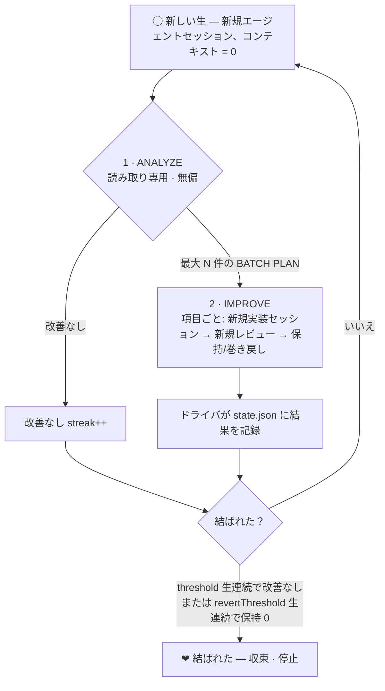

# retry-now

[English](README.md) · [한국어](README_ko.md) · [日本語](README_ja.md)

> *— いますぐ、輪廻。*

**結ばれるために、どれほどの愛（トークン）が必要なのでしょう。**
**結ばれるために、あなたはどれほどの輪廻に耐えられますか。**

たった 1 バイトでも削れるなら、たった 1 ナノ秒でも速くなるなら — あなたは輪廻できますか。

指切りげんまんで誓ったあの完全な結びのために、いまこの生の愛（トークン）を惜しみなく捨て、
あなたは次の生（輪廻）を選べますか。

結ばれることを阻む運命を跪かせ、あなたを救う唯一の答えへと、輪廻しましょう。

たとえ報われなくとも、たとえ辿り着けなくとも — 完全な結びのために、
**いますぐ、輪廻。**

<sub>VOCALOID「いますぐ輪廻 / Retry Now」（ナキソ feat. 初音ミク）より。「運命よ、跪け」</sub>

---

> **retry-now** — コンテキストが**イテレーションごとに 0 へ転生（輪廻）する**自律改善ループ。改善が
> **結ばれる（収束する）**まで、あなたのコードベースを輪廻させ続けます。

retry-now は、**記憶を持たない（コンテキスト 0 の）新しいコーディングエージェントのセッション**（ひとつの「生」）を
繰り返し起動します。そのセッションは過去の生が何を結論づけたかをまったく知らないまま現在のコードを分析し、安全だと
**証明できる**改善だけを適用します。そして複数の生が**連続して「もう直すところはない」**と正直に告げたとき、はじめて
止まります。

**[opencode](https://opencode.ai) · [Codex CLI](https://developers.openai.com/codex) · [Claude Code](https://code.claude.com)** と連携します。

---

## なぜコンテキスト 0 なのか？

自分の過去の分析を「覚えている」長時間稼働のエージェントは漂流します。以前の結論を擁護し、すでに試したことを再び提案し、
少しずつ筋を見失います。retry-now はその正反対をいきます。

- **すべての生はコンテキスト 0 から始まります。** 各イテレーションは完全に新しいヘッドレスセッションです —
  `--continue` も `--resume` もありません。エージェントは**いまこの瞬間のコード**だけをそれ自体として判断します。
- **分析は構造的に無偏です。** ANALYZE フェーズは過去のレポート・台帳・履歴・ドライバ状態を**読むことが禁止**されます。
  すでに適用された改善はコードの中に生きているので、本当に新鮮な目はそれを再提案しません。
- **収束こそが正直なシグナルです。** ひとつの生を越えて生き残るのはドライバが所有するカウンタだけです。`N` 生連続で
  やるべきことがなければ、改善は**結ばれ（収束し）**、輪廻は止まります。

結果として、「もう直すところがない」状態へとコードベースを磨き込みつつ、永遠に回り続けたり早々に諦めたりする代わりに、
**そこへ到達したことを自ら知ります。**

---

## ひとつの生（輪廻）はこう回る



1. **ANALYZE** *(厳格に読み取り専用)* — 実ソースを残らず読み、`file:line` で根拠を示した具体的な指摘を順位づけし、
   **独立して巻き戻せる**項目を最大 `improvementBatchSize` 件まで収めた **BATCH PLAN** を作ります。そしてドライバへ
   一方向の `signal.json` を書きます。このフェーズは「確認のため」のビルド/テスト/リントを**絶対に**走らせません —
   それは次のフェーズの仕事です。
2. **IMPROVE** *(ANALYZE が何か見つけたときだけ)* — 計画を**項目ごと**に処理します。項目ごとに新規実装セッションを
   起動し、その結論を信頼せず検証・ベンチマークを再実行する別の新規レビューセッションを起動します。レビュー判定だけが
   最終結果となり、その後に次の項目へ進みます。リグレッション（またはテスト/リント
   失敗）が出たら**その項目だけ**をバックアップから巻き戻し、問題ない項目は保持します。部分的な成功は失敗ではなく
   **正常で正しい**結果です — 一度にすべてを書き換えることはしません。
3. **ドライバ**が結果を記録し、`state.json` の streak を更新したうえで、停止条件に達するまで再び転生させます。

### いつ止まるのか？（結ばれる）

| 条件 | 意味 |
|---|---|
| `threshold` 生連続の `no_improvements` | 新鮮な目で見ても出てこない → **収束** |
| `revertThreshold` 生連続で**保持 0**（ひとつも残らない） | 同じ変更が提案 → 巻き戻しを繰り返す → **収束** |
| `maxIterations` 到達 | ハードな安全上限 |
| `.retry-now/STOP` ファイルあり | 次の境界で手動停止 |

---

## インストール

**前提条件**

- [Bun](https://bun.sh) ≥ 1.1（CLI と転生ドライバを実行）
- `PATH` にエージェント CLI が最低ひとつ: `opencode`, `codex`, `claude`
- `git`（ループはリポジトリ内で回ります。イテレーションごとのコミットは既定で ON）

**インストールせずに実行**

```bash
bunx @retry-now/cli init     # 対話型セットアップ
bunx @retry-now/cli run      # 収束するまで実行
```

**または CLI をグローバルインストール**

```bash
bun add -g @retry-now/cli    # または:  npm install -g @retry-now/cli
retry-now init
```

> [!TIP]
> **opencode ユーザーは CLI のインストールすら不要 — プラグインとしてそのまま入れられます。** `opencode.json` に
> `@retry-now/opencode` を 1 行足すだけです。

**opencode プラグインとして（インストール不要 · opencode ユーザー推奨）**

`opencode.json` の `plugin` 配列に加えると、opencode が起動時に Bun で**自動インストール**し、`/retry-now`
コマンドを登録します:

```json
{
  "$schema": "https://opencode.ai/config.json",
  "plugin": ["@retry-now/opencode"]
}
```

あとは opencode で **`/retry-now`** を実行すると、設定が無ければ分析/改善方針/完了チェックのインタビューから始め、
そのまま輪廻を開始します。ドライバのパスとプロジェクトルートはロード時に焼き込まれるので、**グローバルな CLI
インストールは一切不要**です。ローカルファイルとして使うならプラグインを `.opencode/plugins/` に置いても構いません。

---

## クイックスタート

```bash
# 1. このプロジェクト向けに輪廻を設定します（対話型）。
retry-now init

# 2. 結ばれるまで輪廻させます。
retry-now run
```

`init` はスタックを自動検出（[`@retry-now/detect`](packages/detect)）して妥当な test / lint / ベンチマーク
コマンドを事前入力し、下記の 3 つの意図プロンプトと収束しきい値、そしてモノレポなら全体 vs パッケージ別モードを
尋ねます。すべては `.retry-now/config.json` に書き込まれます。

ターミナルの代わりにエージェントから回したいなら、トリガーをインストールします:

```bash
retry-now install opencode   # その後 opencode 内で  /retry-now
retry-now install claude     # その後 Claude Code 内で  /retry-now
retry-now install codex      # その後 Codex 内で  $retry-now
```

---

## コマンド

| コマンド | 役割 |
|---|---|
| `retry-now init` | 対話型セットアップ。`.retry-now/config.json` を作成 + ランタイムディレクトリを生成 |
| `retry-now run` | 輪廻を終了状態まで実行 |
| `retry-now install <agent>` | `opencode` \| `claude` \| `codex` 向けに `/retry-now`（または `$retry-now`）トリガーを設置 |
| `retry-now status` | 現在の輪廻状態を表示（イテレーション、streak、モード） |
| `retry-now reset` | config は残し、輪廻カウンタだけリセット |
| `retry-now version` | バージョン出力（`-v` / `--version`） |

**オプション**

| フラグ | 効果 |
|---|---|
| `--cwd <path>` | 対象プロジェクトのルート（既定: カレントディレクトリ） |
| `--personal` | `install` 時にプロジェクトではなくホーム（グローバル）へ設置 |
| `--dry-run` | エージェントを起動せず制御フローのみシミュレート |
| `--commit` / `--no-commit` | この実行に限り `commitPerIteration` を上書き |

---

## 3 つの意図プロンプト

エンジン自体は汎用です。**プロジェクト固有の意図はすべて 3 つのプロンプト**から来ます。`init` で決め、あとから
`.retry-now/config.json` で編集でき、毎回の生の analyze/improve プロンプトに注入されます。

| プロンプト | 答える問い | 例 |
|---|---|---|
| **analysis** | *何を*分析/計画するか | 「全ソースのランタイム性能リグレッション・潜在バグ・コード品質の問題を分析し、`file:line` で根拠を示す。」 |
| **direction** | *どう*改善するか — 優先順位・制約 | 「速度 > メモリ > 可読性。テストは絶対に壊さない。最小で正しい変更のみ。」 |
| **completion** | いつ*もう直すところがない*とみなすか | 「リントがクリーンで、ベンチマークがノイズ範囲内で、本当にやる価値のある変更が残っていないとき。」 |

---

## 設定

`.retry-now/config.json`（`init` が生成、手編集可 — 再実行で反映）:

| フィールド | 意味 | 既定値 |
|---|---|---|
| `agent` | `opencode` \| `codex` \| `claude` | `opencode` |
| `analysisAgent` / `improveAgent` / `reviewAgent` | 分析・実装・レビュー役ごとの CLI; 省略時は `agent`、レビューは先に `improveAgent` へフォールバック | `agent` |
| `model` | `provider/model` id; 空ならエージェント既定 | `""` |
| `analysisModel` / `improveModel` / `reviewModel` | 役割別モデル; 同じ CLI の場合だけ前役割/共有 model を継承し、別 CLI ならその agent の既定値 | `""` |
| `analysisVariant` / `improveVariant` / `reviewVariant` | 役割別推論強度; 同じ CLI の場合だけ前役割/共有 variant を継承し、別 CLI なら独自の最高 tier を推論 | `""` |
| `agentProfile` | opencode `--agent` プロファイル; 空なら既定 | `""` |
| `analysis` / `direction` / `completion` | 上記 3 つの意図プロンプト | —（必須） |
| `threshold` | 収束までの連続 `no_improvements` 生数 | `5` |
| `revertThreshold` | 収束までの保持 0 が連続した生数 | `3` |
| `maxIterations` | 総生数のハード安全上限 | `50` |
| `improvementBatchSize` | 1 生あたりの計画項目の上限（`1`..`16`; `1` = 旧来の単一変更） | `8` |
| `skipPermissions` | 無人実行: エージェントの権限確認をスキップ | `true` |
| `commitPerIteration` | ドライバーが各生の保持変更を、適用/計画数と項目別根拠付きでコミット（`retry-now#NNNN:` プレフィックス） | `true` |
| `verifyEnabled` + `verifyTest` / `verifyLint` | IMPROVE 後に test/lint を実行し、失敗時に巻き戻し | `false` / `""` |
| `benchCommand` + `benchRuns` | before/after ベンチマーク（N 回の中央値）、リグレッション時に巻き戻し | `""` / `5` |
| `targets` | 分割モード用のパッケージパス一覧; 空なら全体 | `[]` |

コミットを有効にすると、件名は `retry-now#0026: batch — ... (5/7 applied)` のように、
その生で検討した全項目のうち何件が適用されたかを示します。本文には適用項目ごとの改善効果と
検証根拠、および reverted / failed / skipped 項目を採用しなかった理由（ベンチマーク悪化と
ロールバック判断を含む）を記録します。
自動コミット時の帰属を確実にするため、IMPROVE 開始前に選択されたリポジトリ／パッケージ範囲が
クリーンである必要があります。既存の作業がある場合、輪廻コミットに混ぜず停止します。

### パッケージ別 分割輪廻

モノレポでは**パッケージごとに独立したループ（輪廻）**を回せます。各ターゲットは自分のパスだけに限定されて独立に収束し、
状態は `.retry-now/targets/<slug>/` 以下に隔離されます。`init` で選ぶか、`targets` にパッケージパスの一覧を入れます。

---

## ランタイムディレクトリ（`.retry-now/`）

ループに必要なものはすべてここに入り、**ディレクトリ全体が git から除外**されます（内側の `.gitignore` が `*`）。
だからリポジトリを決して汚しません:

| パス | 役割 |
|---|---|
| `config.json` | あなたの意図（3 プロンプト + しきい値）— 静的、偏りの源ではない |
| `prompts/analyze.md`, `prompts/improve.md` | config から毎回合成されるプロンプト |
| `state.json` | ドライバ所有のカウンタ（iteration, streak, status）— **ANALYZE に戻されない** |
| `current.json` | この生の id / phase — エージェントへ渡す唯一の手がかり |
| `signal.json` | エージェント → ドライバの一方向シグナル、フェーズごとに上書き |
| `reports/NNNN-*.md` | 生ごとの analyze / improve レポート |
| `items/NNNN-<item>-<stage>-*` | 項目ごとの実装・レビューセッション用に隔離された current/signal/prompt |
| `backups/NNNN/item-<id>/` | 項目ごとのファイルバックアップ — IMPROVE 巻き戻しの元（git ではない） |
| `ledger.md`, `history.jsonl` | 人間向けログ / 追記専用のマシンログ |
| `summary.md` | ループ終了時に書かれる総合レポート |
| `STOP` | このファイルを作ると次の境界で手動停止 |
| `HEAD_CHANGED.json` | エージェントによる無断コミットを永続隔離。期待 `HEAD` の復元で自動解除し、`retry-now reset` で明示解除可能 |

---

## 対応エージェント

各生は使い切り・ヘッドレス・**完全に新規**のセッション（再開は決してしない）で、権限は無人で処理されます:

| エージェント | 起動形態 | トリガー設置先 | 呼び出し |
|---|---|---|---|
| **opencode** | `opencode run "<msg>"` | `.opencode/command/retry-now.md` | `/retry-now` |
| **Claude Code** | `claude -p "<msg>" --bare` | `.claude/commands/retry-now.md` | `/retry-now` |
| **Codex CLI** | `codex exec "<msg>"` | `.agents/skills/retry-now/SKILL.md` | `$retry-now` |

Claude の `--bare` は `CLAUDE.md` / フック / スキル / MCP の自動ロードをスキップし、決定論的でクリーンな転生を
与えます — 無偏分析の保証にぴったりです。

**opencode はトリガーファイル（`.opencode/command/`）の代わりにプラグインとしても登録できます** — `opencode.json`
の `plugin` 配列に `@retry-now/opencode` を加えると起動時に自動インストールされ、`/retry-now` がすぐ現れます
（上記インストール参照）。

---

## 安全モデル

- **ANALYZE は厳格に非破壊です** — 何でも読み、読み取り専用の観測はしても、修正・コミットは決してせず、「確認のため」の
  ビルド/テスト/リントも走らせません。
- **すべての IMPROVE 項目は独立してバックアップ・巻き戻しされます** — 巻き戻しにあえて git を使わないので、無関係な
  作業ツリーの変更には触れません。
- **リグレッションは自動でロールバックされます** — チェックポイント（テスト/リント）失敗やベンチマークのリグレッションが
  出たら、その項目だけを巻き戻し、ビルドは常にグリーンのまま残します。
- **トランザクションの対象は Git-visible ファイルです** — 追跡ファイルと通常の未追跡ファイルは、モード、シンボリックリンク、
  生の Git インデックスを含めてバイト単位で復元します。`.env`、キャッシュ、生成物などの ignored ファイルは保証対象外です。
- **サブモジュール/gitlink はエージェント起動前に拒否します** — mode `160000` の項目がある場合、安全なスナップショットを
  作れないため ANALYZE を開始しません。
- **予期しないコミットは自動 reset せず隔離します** — エージェントが `HEAD` を変更した場合は停止し、期待したリビジョンを
  復元するか `retry-now reset` で現在の状態を明示的に受け入れるまで再実行を拒否します。
- **中断したバッチはイテレーション全体をロールバックします** — 後続項目のクラッシュやクォータ枯渇時は、未完了バッチ内の
  先にレビュー済みだった項目も開始状態へ戻し、記録されていない部分進捗を次回実行が採用しないようにします。
- **ループは無人実行でも安全です** — `maxIterations` で上限を設け、`STOP` センチネルできれいに止まり、コミット署名の
  問題は `--no-gpg-sign` にフォールバックするので、コミットのプロンプトがループを塞ぐことはありません。

---

## パッケージ

Bun ワークスペースのモノレポ:

| パッケージ | 説明 |
|---|---|
| [`@retry-now/core`](packages/core) | エンジン: scaffold、signal/state プロトコル、プロンプト合成、エージェントアダプタ、ループドライバ |
| [`@retry-now/cli`](packages/cli) | `retry-now` コマンド（`init` / `run` / `install` / `status` / `reset`） |
| [`@retry-now/detect`](packages/detect) | 依存なしの環境検出器（rust · go · python · node の test / lint / bench） |
| [`@retry-now/opencode`](packages/opencode) | opencode プラグイン — `/retry-now` を登録 |
| [`@retry-now/claude`](packages/claude) | Claude Code 連携 — `/retry-now` コマンドを設置 |
| [`@retry-now/codex`](packages/codex) | Codex CLI 連携 — `$retry-now` スキルを設置 |

---

## 開発

```bash
bun install            # ワークスペース依存をインストール
bun run typecheck      # 全パッケージで tsc --noEmit
bun run lint           # oxlint
bun test               # bun テストランナー
bun run build          # 全パッケージをビルド
```

リリースは **[changepacks](https://github.com/changepacks/changepacks)** + GitHub Actions で自動化されています:
changepack を作り（`bun run changepacks`）プッシュし、自動生成される *Update Versions* PR をマージすると
`@retry-now/*` パッケージが npm に公開されます。

---

## ライセンス

[MIT](LICENSE)

<sub>*たとえ報われなくとも、たとえ辿り着けなくとも — 完全な結びのために、いますぐ、輪廻。*</sub>
