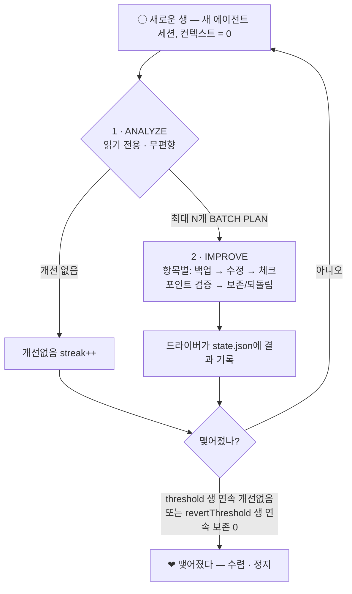

# retry-now

[English](README.md) · [한국어](README_ko.md) · [日本語](README_ja.md)

> *— 지금 바로 윤회.*

**맺어지기 위해, 얼마나 많은 사랑(토큰)이 필요할까요.**
**맺어지기 위해, 당신은 얼마나 많은 윤회를 견딜 수 있을까요.**

단 1바이트라도 아낄 수 있다면, 단 1나노초라도 개선된다면 — 당신은 윤회할 수 있습니까.

새끼손가락 걸고 약속한 완벽한 맺어짐을 위해, 지금 이 생의 사랑(토큰)을 과감히 버리고
당신은 다음 생(윤회)을 택할 수 있습니까.

맺어지지 못하게 하는 운명을 무릎 꿇리고, 당신을 구원해 줄 단 하나의 정답을 향해 윤회하십시오.

설령 보답받지 못하더라도, 끝내 도달하지 못하더라도 — 완벽한 맺어짐을 위하여,
**지금 바로 윤회!**

<sub>「いますぐ輪廻 / Retry Now」 — 나키소(ナキソ) · 初音ミク 의 VOCALOID 곡에서. 「運命よ、跪け」</sub>

---

> **지금 바로 윤회** — 컨텍스트가 **매 이터레이션마다 0으로 환생**하는 자율 개선 윤회(루프).
> 개선이 **맺어질(수렴할)** 때까지 당신의 코드베이스를 계속 윤회시킵니다.

retry-now는 **기억이 없는(컨텍스트 0) 새 코딩 에이전트 세션**("한 생", 윤회)을 반복해서 띄웁니다. 그 세션은 이전 생들이
무슨 결론을 내렸는지 전혀 모른 채 현재 코드를 분석하고, 안전하다고 **증명할 수 있는** 개선들만 적용합니다.
그리고 여러 생이 **연속으로 "더 고칠 게 없다"** 고 솔직하게 말할 때 비로소 멈춥니다.

**[opencode](https://opencode.ai) · [Codex CLI](https://developers.openai.com/codex) · [Claude Code](https://code.claude.com)** 와 함께 동작합니다.

---

## 왜 컨텍스트 0인가?

자기 과거 분석을 "기억하는" 장기 실행 에이전트는 표류합니다. 이전 결론을 방어하고, 이미 시도한 것을 다시 제안하며,
서서히 길을 잃습니다. retry-now는 정반대로 갑니다.

- **매 생은 컨텍스트 0에서 시작합니다.** 각 이터레이션은 완전히 새로운 헤드리스 세션입니다 — `--continue`도, `--resume`도
  없습니다. 에이전트는 **지금 이 순간의 코드**를 그 자체로만 판단합니다.
- **분석은 구조적으로 무편향입니다.** ANALYZE 단계는 이전 리포트·렉저·히스토리·드라이버 상태를 **읽는 것이 금지**됩니다.
  이미 적용된 개선은 코드 안에 살아 있으므로, 진짜로 새로 보는 눈은 그것을 다시 제안하지 않습니다.
- **수렴이 곧 정직한 신호입니다.** 한 생을 넘어 살아남는 유일한 것은 드라이버가 소유한 카운터뿐입니다. `N`생 연속으로
  할 만한 게 없으면 개선은 **맺어졌고(수렴)**, 윤회는 멈춥니다.

결과적으로 "더 고칠 게 없는" 상태를 향해 코드베이스를 갈아넣되, 영원히 돌거나 일찍 포기하는 대신 **그 지점에
도달했음을 스스로 압니다.**

---

## 한 생(윤회)은 이렇게 돈다



1. **ANALYZE** *(엄격히 읽기 전용)* — 실제 소스를 빠짐없이 읽고, `file:line`으로 근거를 단 구체적 발견들을 순위 매긴
   뒤, **독립적으로 되돌릴 수 있는** 항목을 최대 `improvementBatchSize`개까지 담은 **BATCH PLAN**을 만듭니다. 그리고
   드라이버에게 단방향 `signal.json`을 씁니다. 이 단계는 "확인차" 빌드/테스트/린트를 절대 돌리지 않습니다 — 그건 다음
   단계의 몫입니다.
2. **IMPROVE** *(ANALYZE가 뭔가 찾았을 때만)* — 계획을 **항목별로** 처리합니다. 건드릴 파일을 먼저 백업하고, 가장 작은
   올바른 변경을 가한 뒤, 체크포인트 그룹 단위로 검증합니다. 회귀(또는 테스트/린트 실패)가 나면 **그 항목만** 백업에서
   되돌리고, 멀쩡한 항목은 보존합니다. 부분 성공은 실패가 아니라 **정상적이고 올바른 결과**입니다 — 한 방에 갈아엎지 않습니다.
3. **드라이버**가 결과를 기록하고 `state.json`의 streak을 갱신한 뒤, 정지 조건에 닿을 때까지 다시 환생시킵니다.

### 언제 멈추나? (맺어진다)

| 조건 | 의미 |
|---|---|
| `threshold` 생 연속 `no_improvements` | 새 눈으로 봐도 계속 나올 게 없음 → **수렴** |
| `revertThreshold` 생 연속 **보존 0** (한 항목도 못 남김) | 같은 변경이 제안→되돌림만 반복됨 → **수렴** |
| `maxIterations` 도달 | 하드 안전 상한 |
| `.retry-now/STOP` 파일 존재 | 다음 경계에서 수동 정지 |

---

## 설치

**전제조건**

- [Bun](https://bun.sh) ≥ 1.1 (CLI와 환생 드라이버를 실행)
- `PATH`에 에이전트 CLI 중 최소 하나: `opencode`, `codex`, `claude`
- `git` (윤회는 레포 안에서 돕니다; 이터레이션별 커밋이 기본 켜짐)

**설치 없이 실행**

```bash
bunx @retry-now/cli init     # 대화형 설정
bunx @retry-now/cli run      # 수렴할 때까지 윤회 실행
```

**또는 CLI를 전역 설치**

```bash
bun add -g @retry-now/cli    # 또는:  npm install -g @retry-now/cli
retry-now init
```

> [!TIP]
> **opencode 사용자는 CLI 설치조차 필요 없습니다 — 플러그인으로 바로 넣을 수 있습니다.** `opencode.json` 에
> `@retry-now/opencode` 한 줄이면 됩니다.

**opencode 플러그인으로 (설치 불필요 · opencode 사용자 권장)**

`opencode.json` 의 `plugin` 배열에 추가하면, opencode가 시작할 때 Bun으로 **자동 설치**하고 `/retry-now`
명령을 등록합니다:

```json
{
  "$schema": "https://opencode.ai/config.json",
  "plugin": ["@retry-now/opencode"]
}
```

이후 opencode에서 **`/retry-now`** 를 실행하면, 설정이 없을 때 분석/개선방향/완료체크 인터뷰부터 진행한 뒤
바로 윤회를 시작합니다. 드라이버 경로·프로젝트 루트가 로드 시점에 박히므로 **전역 CLI 설치가 전혀 필요 없습니다.**
로컬 파일로 쓰려면 플러그인을 `.opencode/plugins/` 에 두어도 됩니다.

---

## 빠른 시작

```bash
# 1. 이 프로젝트에 맞게 윤회를 설정합니다 (대화형).
retry-now init

# 2. 맺어질 때까지 윤회시킵니다.
retry-now run
```

`init`은 당신의 스택을 자동 감지([`@retry-now/detect`](packages/detect))해서 적당한 test / lint / 벤치마크 명령을
미리 채워 주고, 아래의 세 가지 의도 프롬프트와 수렴 임계값, 그리고 모노레포라면 전체 vs 패키지별 모드를 묻습니다.
모든 결과는 `.retry-now/config.json`에 쓰입니다.

터미널 대신 에이전트에서 돌리고 싶으면 트리거를 설치합니다:

```bash
retry-now install opencode   # 이후 opencode 안에서  /retry-now
retry-now install claude     # 이후 Claude Code 안에서  /retry-now
retry-now install codex      # 이후 Codex 안에서  $retry-now
```

---

## 명령어

| 명령 | 하는 일 |
|---|---|
| `retry-now init` | 대화형 설정; `.retry-now/config.json` 작성 + 런타임 디렉토리 스캐폴드 |
| `retry-now run` | 윤회를 종료 상태까지 실행 |
| `retry-now install <agent>` | `opencode` \| `claude` \| `codex` 용 `/retry-now`(또는 `$retry-now`) 트리거 설치 |
| `retry-now status` | 현재 윤회 상태 보기 (이터레이션, streak, 모드) |
| `retry-now reset` | config는 유지하고 윤회 카운터만 리셋 |
| `retry-now version` | 버전 출력 (`-v` / `--version`) |

**옵션**

| 플래그 | 효과 |
|---|---|
| `--cwd <path>` | 대상 프로젝트 루트 (기본: 현재 디렉토리) |
| `--personal` | `install` 시 프로젝트가 아닌 홈(전역)에 설치 |
| `--dry-run` | 에이전트를 띄우지 않고 제어 흐름만 시뮬레이션 |
| `--commit` / `--no-commit` | 이번 실행만 `commitPerIteration` 덮어쓰기 |

---

## 세 가지 의도 프롬프트

엔진 자체는 범용입니다. **프로젝트별 의도는 전부 세 개의 프롬프트**에서 옵니다. `init`에서 정하고 나중에
`.retry-now/config.json`에서 수정할 수 있으며, 매 생의 analyze/improve 프롬프트에 주입됩니다.

| 프롬프트 | 답하는 질문 | 예시 |
|---|---|---|
| **analysis** | *무엇을* 분석/계획할지 | "모든 소스에서 런타임 성능 회귀·잠재 버그·코드 품질 이슈를 분석하고 `file:line`으로 근거를 단다." |
| **direction** | *어떻게* 개선할지 — 우선순위·제약 | "속도 > 메모리 > 가독성. 테스트는 절대 깨지 않는다. 가장 작은 올바른 변경만." |
| **completion** | 언제 *더 고칠 게 없다*고 볼지 | "린트가 깨끗하고, 벤치마크가 노이즈 범위 안이며, 진짜로 할 만한 변경이 안 남았을 때." |

---

## 설정

`.retry-now/config.json` (`init`이 생성, 손으로 수정 가능 — 다시 실행하면 반영됨):

| 필드 | 의미 | 기본값 |
|---|---|---|
| `agent` | `opencode` \| `codex` \| `claude` | `opencode` |
| `model` | `provider/model` id; 비우면 에이전트 기본값 | `""` |
| `agentProfile` | opencode `--agent` 프로필; 비우면 기본값 | `""` |
| `analysis` / `direction` / `completion` | 위의 세 의도 프롬프트 | — (필수) |
| `threshold` | 수렴까지 연속 `no_improvements` 생 수 | `5` |
| `revertThreshold` | 수렴까지 보존 0이 연속된 생 수 | `3` |
| `maxIterations` | 총 생 수 하드 안전 상한 | `50` |
| `improvementBatchSize` | 한 생당 계획 항목 최대치 (`1`..`16`; `1` = 옛 단일 변경) | `8` |
| `skipPermissions` | 무인 실행: 에이전트 권한 확인 건너뜀 | `true` |
| `commitPerIteration` | 매 생의 보존 변경을 git 커밋 (`retry-now#NNNN:` 프리픽스) | `true` |
| `verifyEnabled` + `verifyTest` / `verifyLint` | IMPROVE 후 test/lint 실행, 실패 시 되돌림 | `false` / `""` |
| `benchCommand` + `benchRuns` | before/after 벤치마크(N회 중앙값), 회귀 시 되돌림 | `""` / `5` |
| `targets` | 분할 모드용 패키지 경로 목록; 비우면 전체 레포 | `[]` |

### 패키지별 분할 윤회

모노레포에서는 **패키지마다 독립된 윤회(루프)**를 돌릴 수 있습니다. 각 타겟은 자기 경로에만 한정되어 독립적으로 수렴하고,
상태는 `.retry-now/targets/<slug>/` 아래에 격리됩니다. `init`에서 고르거나 `targets`에 패키지 경로 목록을 넣으면 됩니다.

---

## 런타임 디렉토리 (`.retry-now/`)

윤회에 필요한 모든 것이 여기 들어가며, **디렉토리 전체가 git에서 제외됩니다**(안쪽 `.gitignore`가 `*`). 그래서 레포를
절대 더럽히지 않습니다:

| 경로 | 역할 |
|---|---|
| `config.json` | 당신의 의도(3개 프롬프트 + 임계값) — 정적, 편향원 아님 |
| `prompts/analyze.md`, `prompts/improve.md` | config로 매 실행 합성되는 프롬프트 |
| `state.json` | 드라이버 소유 카운터(iteration, streak, status) — **ANALYZE에 되먹이지 않음** |
| `current.json` | 이번 생의 id / phase — 에이전트에 주는 유일한 단서 |
| `signal.json` | 에이전트 → 드라이버 단방향 신호, 매 phase 덮어씀 |
| `reports/NNNN-*.md` | 생별 analyze / improve 리포트 |
| `backups/NNNN/item-<id>/` | 항목별 파일 백업 — IMPROVE 되돌림의 원본 (git 아님) |
| `ledger.md`, `history.jsonl` | 사람용 로그 / append-only 머신 로그 |
| `summary.md` | 윤회 종료 시 작성되는 종합 보고서 |
| `STOP` | 이 파일을 만들면 다음 경계에서 수동 정지 |

---

## 지원 에이전트

매 생은 일회성·헤드리스·**완전히 새로운** 세션이며(절대 재개 안 함), 권한은 무인으로 처리됩니다:

| 에이전트 | 실행 형태 | 트리거 설치 위치 | 호출 |
|---|---|---|---|
| **opencode** | `opencode run "<msg>"` | `.opencode/command/retry-now.md` | `/retry-now` |
| **Claude Code** | `claude -p "<msg>" --bare` | `.claude/commands/retry-now.md` | `/retry-now` |
| **Codex CLI** | `codex exec "<msg>"` | `.agents/skills/retry-now/SKILL.md` | `$retry-now` |

Claude의 `--bare`는 `CLAUDE.md` / 훅 / 스킬 / MCP 자동 로드를 건너뛰어 결정론적인 깨끗한 환생을 줍니다 — 무편향
분석 보장에 딱 맞습니다.

**opencode는 위 트리거 파일(`.opencode/command/`) 대신 플러그인으로도 등록할 수 있습니다** — `opencode.json` 의
`plugin` 배열에 `@retry-now/opencode` 를 추가하면 시작 시 자동 설치되어 `/retry-now` 가 바로 생깁니다 (위 설치 참고).

---

## 안전 모델

- **ANALYZE는 엄격히 비파괴입니다** — 무엇이든 읽고 읽기 전용 관찰은 해도, 수정·커밋은 절대 하지 않고 "확인차"
  빌드/테스트/린트도 돌리지 않습니다.
- **모든 IMPROVE 항목은 독립적으로 백업되고 되돌려집니다** — 되돌림에 git을 일부러 쓰지 않으므로, 무관한 워킹트리 변경을
  건드리지 않습니다.
- **회귀는 자동으로 롤백됩니다** — 체크포인트(테스트/린트) 실패나 벤치마크 회귀가 나면 문제의 항목만 되돌리고, 빌드는
  항상 초록으로 남깁니다.
- **윤회는 무인 실행에 안전합니다** — `maxIterations`로 상한을 두고, `STOP` 센티넬로 깔끔히 멈추며, 커밋 서명 문제는
  `--no-gpg-sign`으로 폴백해 커밋 프롬프트가 윤회를 막는 일이 없습니다.

---

## 패키지

Bun 워크스페이스 모노레포:

| 패키지 | 설명 |
|---|---|
| [`@retry-now/core`](packages/core) | 엔진: 스캐폴드, signal/state 프로토콜, 프롬프트 합성, 에이전트 어댑터, 윤회 드라이버 |
| [`@retry-now/cli`](packages/cli) | `retry-now` 명령 (`init` / `run` / `install` / `status` / `reset`) |
| [`@retry-now/detect`](packages/detect) | 의존성 없는 환경 감지기 (rust · go · python · node의 test / lint / bench) |
| [`@retry-now/opencode`](packages/opencode) | opencode 플러그인 — `/retry-now` 등록 |
| [`@retry-now/claude`](packages/claude) | Claude Code 연동 — `/retry-now` 명령 설치 |
| [`@retry-now/codex`](packages/codex) | Codex CLI 연동 — `$retry-now` 스킬 설치 |

---

## 개발

```bash
bun install            # 워크스페이스 의존성 설치
bun run typecheck      # 전 패키지 tsc --noEmit
bun run lint           # oxlint
bun test               # bun 테스트 러너
bun run build          # 전 패키지 빌드
```

릴리스는 **[changepacks](https://github.com/changepacks/changepacks)** + GitHub Actions로 자동화됩니다: changepack을
만들고(`bun run changepacks`) 푸시한 뒤, 자동 생성되는 *Update Versions* PR을 머지하면 `@retry-now/*` 패키지가
npm에 배포됩니다.

---

## 라이선스

[MIT](LICENSE)

<sub>*설령 보답받지 못하더라도, 끝내 도달하지 못하더라도 — 완벽한 맺어짐을 위하여, 지금 바로 윤회.*</sub>
